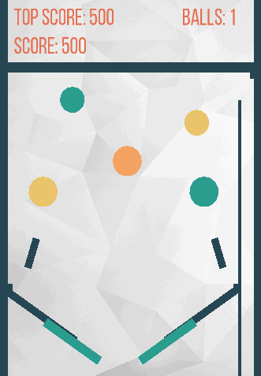

## Description 

Basic pinball game developed in C++ as an assignment for the AI &amp; Physics Modelling module during BSc degree. 
The project uses SFML for sprite rendering, whereas the code for physics, such as collision detection, impulses and movement mechanics were developed without frameworks. 

Date: 2014

## Dependecies

- SFML-2.4.2

## Preview 

